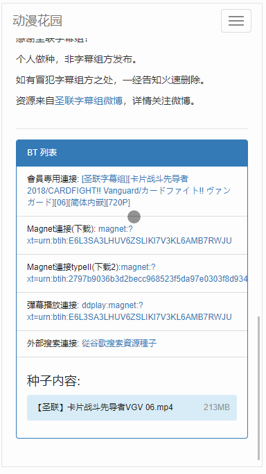

# Dmhy「动漫花园」- Mobile

## 说明

- 动漫花园第三方移动版，使用 Angular(v1.7) + ASP.Net WebAPI 方式开发
- 使用 HtmlAgilityPack 获取「动漫花园」对应页面的数据

## 预览

Dmhy-Mobile网址：[点击查看](http://dmhy.amortal.cn)

### 手机

### PC

## 分析

### 动漫花园分析

| 页面   | 作用         | 页面地址                     | 备注 |
| -------- | -------------- | -------------------------------- | ---- |
| Index    | 展示最新的数据 | /topics/list/page/2              |      |
| Search   | 搜索的数据 | /topics/list/page/1?keyword=name |      |
| Detailed | 详细页面   | /topics/view/( name ).html       |      |

### 前端页面分析

| 页面   | 作用         | 页面地址 | 备注 |
| -------- | -------------- | ----------- | ---- |
| Topics   | 展示最新的数据 | # /Topics   | 分页 |
| Search   | 搜索的数据 | # /Search   | 分页 |
| Schedule | 时间表      | # /Schedule |      |
| Detailed | 详细页面   | # /Detailed |      |
| About    | 关于         | # /Detailed |      |

### 接口分析

| API          | 作用                | 接口地址                                    | 备注 |
| ------------ | --------------------- | ----------------------------------------------- | ---- |
| Topics       | 展示最新的数据 | /V1/Anime/Topics?page=index                     |      |
| Search       | 搜索的数据       | /V1/Anime/Search?keyword=name&amp;page=index        |      |
| TeamPost     | 根据字幕组Id 获取番剧 | /V1/Anime/TeamPost?teamId=id&amp;page=index         |      |
| CategoryPost | 根据类别ID 获取番剧 | /V1/Anime/CategoryPost?categoryId=id&amp;page=index |      |
| Schedule     | 展示时间表       | /V1/Anime/Schedule                              |      |
| Detailed     | 详细数据          | /V1/Anime/Detailed/Id                           |      |
